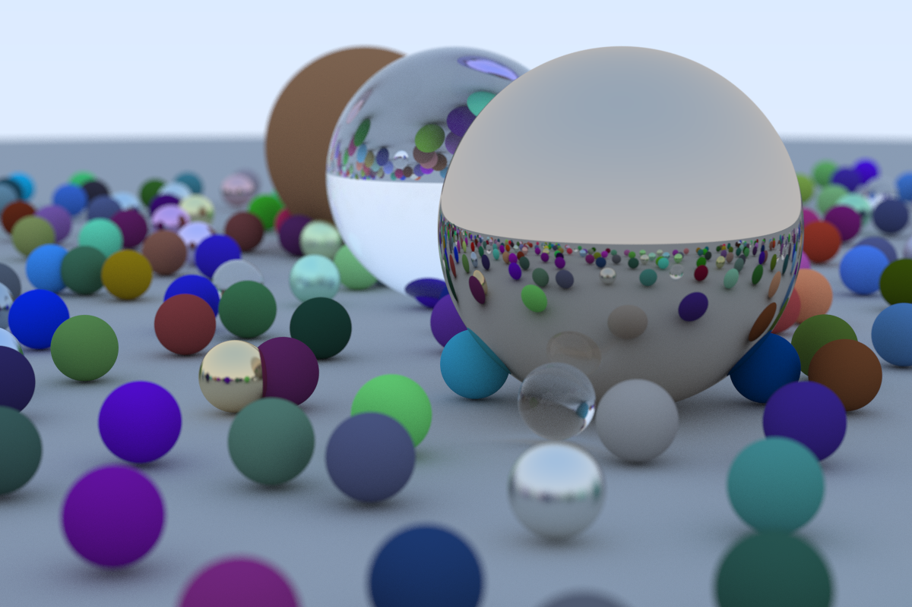

# # raytracer

Raytracer in Rust following the [_Ray Tracing in One Weekend_](https://raytracing.github.io/books/RayTracingInOneWeekend.html) guide.

## Running

- [Download binary](https://github.com/mhagglun/raytracer/releases/download/v1.0.0/raytracer)
- `./raytracer > image.ppm`

## Final render

